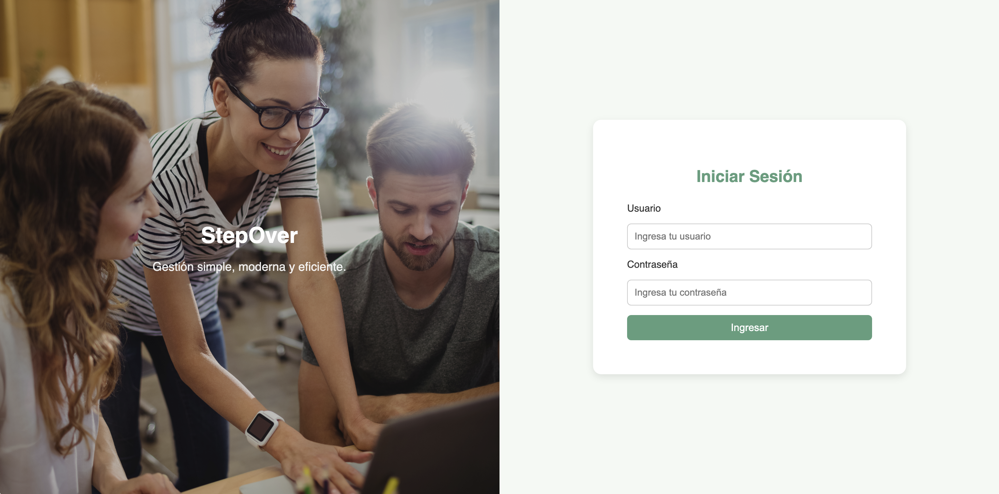
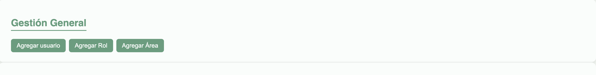
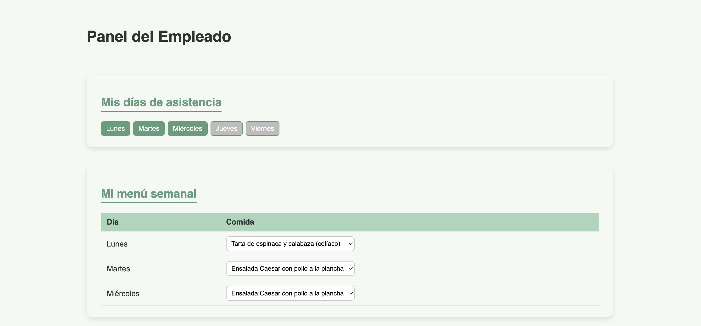
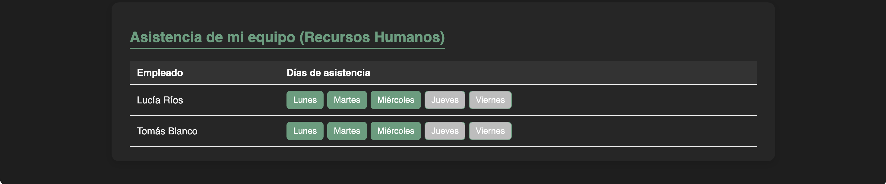

# Stepover – Sistema de Gestión de Comidas y Turnos Semanales

Stepover es una aplicación web, cuyo objetivo es gestionar usuarios, asignar días laborales presenciales y registrar pedidos de comida para esos dias. Usando únicamente React + LocalStorage.
El proyecto incluye un panel para admin, jefes y otro para empleados, permitiendo administrar información de manera clara, organizada y totalmente funcional.

## Funcionalidades

### Gestion General

* Alta de usuarios mediante modal.
* Creación de roles.
* Creación de áreas.

### Calendario semanal
* Visualización interactiva semana laboral (Lunes a Viernes).
* Selección de días laborales con estados visuales.
* Modo administrador: edición de datos.
* Modo empleado: vista de "mi area" sin edición de asignacion semanal, solo eleccion de comida en dias asignados por el jefe.
* Persistencia de los días asignados mediante LocalStorage.

### Gestión de comidas:
* Asignación de comidas a cada día habilitado.
* Modal para agregar nuevos tipos de comida.
* Paginación (hasta 5 elementos por página).
* Asociación automática entre día habilitado y pedido del usuario.

### Modo claro / modo oscuro:
* Implementación de un toggle animado con íconos de sol y luna.
* Transición visual suave entre ambos modos.

### Estructura organizada en:
    components/
    context/
    pages/
    styles/

### Links importantes

Repositorio GitHub: [(Link)](https://github.com/lukasako/PARCIAL2_STEPOVER)

### Profesor
 Gaitan Fernando Gonzalo

### Autor
Lucas Morales – ACN4AV
